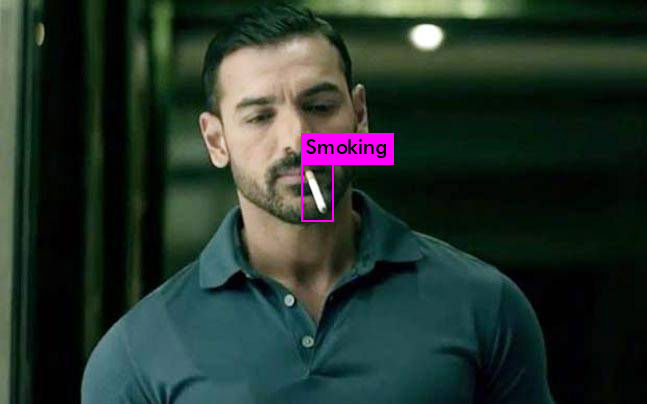
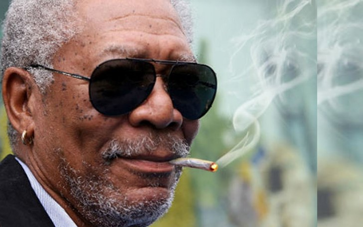
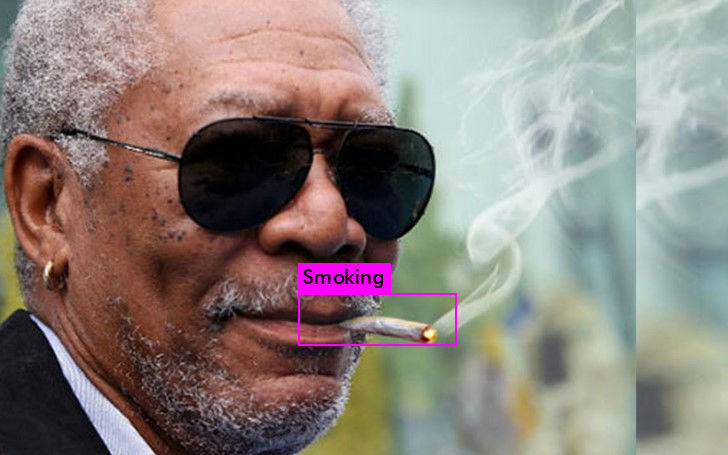

# Cigarette Smoking Detection using Deep Learning

This is a project of detecting Cigarette Smoking from the given images. The codes are based on implementation of Yolo-v3 by (https://github.com/AlexeyAB/darknet) on Python 3. The model generates bounding boxes for each instance of an object(Cigarette) in the image. The model is trained on on google colab for 1880 epochs.

The codes and examples can be found in [smoking_detection.ipynb](smoking_detection.ipynb).

# Example

  
   

  
   

